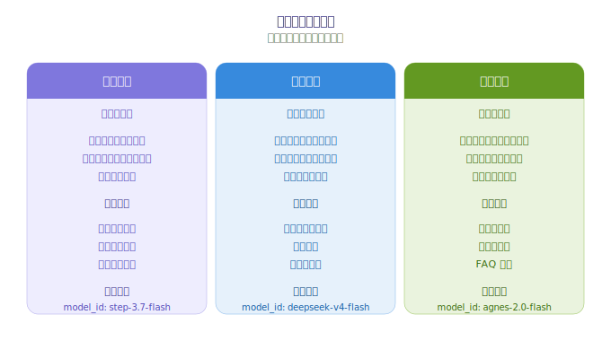
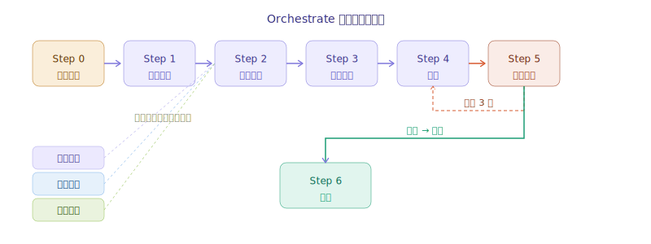

# 🧠 智囊团 — WorkBuddy 多模型协作 Skill 三件套

> GPT-5.5 + Claude + DeepSeek + GLM + 千问 + StepFun + Agnes AI — 七个顶级模型，一个任务同时上。
> 每个模型都有自己的盲区，但让它们坐在一起开会——你得到的是集体智慧。

[](https://opensource.org/licenses/MIT)
[](https://www.codebuddy.cn)

<p align="center">
  
</p>

---

## 💡 核心哲学

任何单一 AI 模型都有结构性的盲区。GPT-5.5 广度无敌但不够严谨，Claude 严谨但偏保守，DeepSeek 深度强但视角单一，GLM 逻辑清晰但创意不足。

**一个模型再强，也不可能同时具备所有思维优势。**

> 一个人的聪明是单线程的，一群人的智慧是网状的。多模型协作不是在选最好的答案——是在编织你的单模型永远织不出的思维导图。

---

## 三兄弟

| | 🧠 智囊团 | 🪶 轻装智囊 | 👥 分身协作 |
|---|:---:|:---:|:---:|
| **能力** | API 直调并行分析 | 同上，零依赖 | Agent 代码生成 |
| **速度** | 30-90s | 30-90s | 5-10min |
| **产出** | 结构化报告 | 结构化报告 | 代码文件 |

### 模型分工



| Tier | 角色 | 代表模型 | 负责 |
|------|------|----------|------|
| 🚀 **高级** | 架构师 | GPT-5.5、Claude Opus 4.8 | 拆解、复杂推理、聚合 |
| 💡 **中级** | 主工程师 | DeepSeek V4 Pro、GLM 5.2 | 子任务执行 |
| ⚡ **基础** | 助理 | 千问、StepFun、Agnes AI | 简单查询、格式化 |

---

## 安装

```bash
cp -r 智囊团 轻装智囊 分身协作 ~/.workbuddy/skills/
pip install openai  # 智囊团
pip install requests  # 轻装智囊
```

重启 WorkBuddy，说「智囊团」触发配置。

---

## 触发词

| 说 | 效果 |
|----|------|
| 「智囊团，分析xxx」 | 完整编排 |
| 「并行对比xxx」 | 多模型同时回答 |
| 「管道接力：A→B→C」 | 串行链 |
| 「轻装智囊，xxx」 | 零依赖版 |
| 「分身，帮我开发xxx」 | Agent 代码生成 |

---

## 特性



- ⚡ **真并行** — ThreadPoolExecutor
- 🔄 **自动回退** — 崩了换备胎
- 📊 **进度反馈** — 实时 [1/3][2/3][3/3]
- 🔧 **配置驱动** — 自动同步 models.json

---

## 许可

MIT | 作者 Timi
